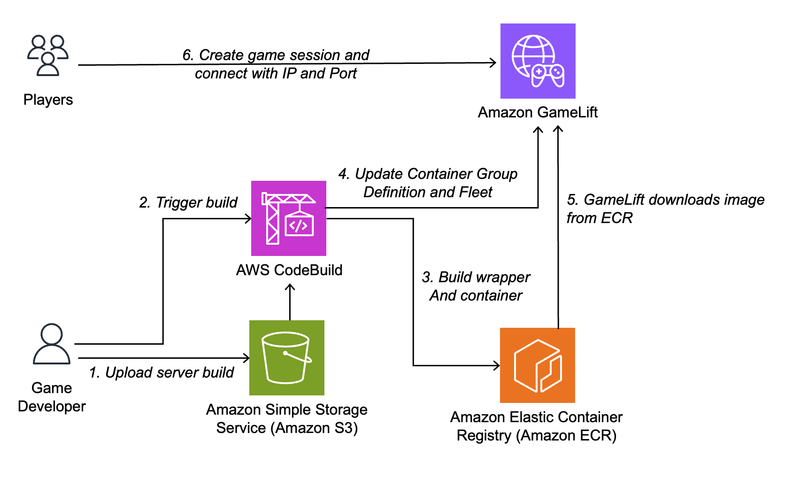

# Amazon GameLift Containers Starter Kit

This solution provides an easy start with Container Fleets on Amazon GameLift. You can use any game server Linux binary you have, and you are not required to integrate with the Amazon GameLift Server SDK to get started. We also utilize AWS CloudFormation and Amazon CodeBuild to create the required Amazon GameLift resources, and to deploy new game server versions on the fleet. You don't need to install any tools locally, and can simply upload your game server build to Amazon S3 and deploy with a single button in the CodeBuild project.

When you want to take advantage of the full features of the Amazon GameLift Server SDK, you can follow the instructions to [integrate with the Amazon GameLift Server SDK directly](#removing-the-wrapper-to-utilize-the-amazon-gamelift-server-sdk-directly).

Total time for deploying the solution utilizing your existing Linux server build is around 15-30 minutes.

# Getting started

**Clone** this repository and open the correct folder by running the following command in CloudShell:

```bash
git clone https://github.com/aws/amazon-gamelift-toolkit.git
cd amazon-gamelift-toolkit/containers-starter-kit/
```

You should also open the `containers-starter-kit` folder in your favorite IDE or editor.

## 1. Deploy the Amazon GameLift Fleet and CodeBuild build automation 

1. Open the **AWS CloudFormation console** in your browser and select **Create stack** -> **With new resources** 
3. Select **Upload template**  and upload the `fleet_deployment_pipeline.yml` file, and select **Next**
4. Enter the **Stack Name**. You can use any name you want. For quick testing, just set the the **Port** and **Protocol** fields to match your game server's configuration and select **Next**.
5. Acknowledge the creation of IAM resources, and select **Next**. Then review and select **Submit**

**NOTE:** The fleet is configured to be development environment friendly, ie. it doesn't protect game sessions from terminations. Same applies to the game server version updates we are doing. It's worth enabling protection for both [the fleet (NewGameSessionProtectionPolicy)](https://docs.aws.amazon.com/AWSCloudFormation/latest/UserGuide/aws-resource-gamelift-containerfleet.html#cfn-gamelift-containerfleet-newgamesessionprotectionpolicy), as well as [the deployments (--new-game-session-protection-policy)](https://docs.aws.amazon.com/cli/latest/reference/gamelift/update-container-fleet.html) in production.

## 2. Set up your server build

1. Copy your game server Linux build to the `ServerBuild` folder. This is typically an Unreal or Unity headless server build, but it can be any binary that runs on Linux.
2. Open `wrapper.sh` and set
    1. The port you're using for your game server (`PORT=1234`)
    2. Your game server binary path (`SERVER_BINARY_PATH=ServerBuild/yourgameserverbinaryhere`)
3. Create a zip file called `gameserver.zip`that contains all the files compressed _from the root_ of this folder (including the SdkGoWrapper and ServerBuild subfolders). **NOTE:** This zip file should **not** include the parent folder, you need to include all the files and folders _inside_ the parent folder for the zip (such as wrapper.h, Dockerfile, and the subfolders). 

**NOTE:** The Dockerfile is configured to run as a custom non-root user to support Unreal Engine server builds. If you run a Unreal server binary directly, the above works as is. If you however want to run the `yourgameserver.sh` file, make sure to modify the wrapper to make that executable too (see wrapper.sh notes).

In case your game server requires additional packages or configuration on the container, see [Customizing the Dockerfile](#customizing-the-dockerfile).

## 3. Upload your game server build and deploy to fleet

1. In the CloudFormation console, select **Outputs** in your stack, and open the link for **GameServerBuildBucket** in a new tab
2. Upload `gameserver.zip` by selecting **Upload**, then dragging your `gameserver.zip` to the upload area and selecting **Upload** again
3. After the upload is complete, go back to the CloudFormation console, open the link for **GameServerCodeBuildProject** in a new tab
4. Select **Start build** to start the build of your container image and the Amazon GameLift Container Group Definition that will be automatically deployed to the fleet created before

**NOTE:** Uploading a large build (such as an Unreal server) can be slow through the browser. It's a lot faster using the [AWS CLI](https://docs.aws.amazon.com/cli/latest/reference/s3/cp.html).

You can follow the build process in CodeBuild to make sure it succeeds without errors. If you want to see the steps of the build process, select the *Build Details* tab and review the *BuildSpec*. This includes setting up the SDK, building your container, and deploying a new container group to the fleet. After the build succeeds, you can use the Amazon GameLift console to review the deployment of the container group to your Amazon GameLift fleet. Once the fleet is active, you can move on to testing with a game session.

# Test by creating a game session

1. Open **AWS CloudShell** in the AWS Management console in your browser (or use the AWS CLI locally)
2. Create a game session by running the following command with your Fleet ID and the region you used when deploying the solution

```bash
aws gamelift create-game-session --fleet-id <YOURFLEETIDHERE> --location <YOURREGION> --maximum-player-session-count 10
```

3. You will receive an **IP** and a **Port** for the game session along with other information. Use the port and IP to connect to the session from your game client. Optimally your game server should terminate after it has completed hosting a session, which will trigger the game session to terminate and be replaced with a new container.

# Getting game session data from the SDK wrapper

Your game server can retrieve the initial game session data, as well as updated data (matchmaking backfills) by making a `GET` HTTP request to the localhost endpoint provided by the wrapper:

```localhost:8090/gamesessiondata```

The response always contains a JSON string with the game session info, but the fields are empty if there is no game session assigned to the process yet. When the game session is updated with more players by FlexMatch (in case you're using it), the updated game session is automatically returned.

The game session data JSON string value has the following format:
```json
{
    "GameSessionId": "arn:aws:gamelift:REGION::gamesession/FLEET/GAMESESSION",
    "GameSessionData": "DATA",
    "Name": "NAME",
    "MatchmakerData": "{\"matchId\":\"ID\",\"matchmakingConfigurationArn\":\"arn:aws:gamelift:REGION:ACCOUNT:matchmakingconfiguration/NAME\",\"teams\":[{\"NAME\":\"VALUE\",\"players\":[{\"playerId\":\"123\",\"attributes\":{\"NAME\":{\"attributeType\":\"TYPE\",\"valueAttribute\":\"VALUE\"}}}]}],\"autoBackfillMode\":\"AUTOMATIC|MANUAL\",\"autoBackfillTicketId\":\"auto-backfill-TICKETID\"}",
    "FleetId": "containerfleet-FLEETID",
    "Location": "",
    "MaximumPlayerSessionCount": 123,
    "IpAddress": "1.2.3.4",
    "Port": 1234,
    "DnsName": "DNS.REGION.compute.amazonaws.com",
    "GameProperties": {
        "NAME": "VALUE"
    },
    "StatusReason": "VALUE"
}
```

**NOTE:** While this localhost endpoint provides you basic information, it is recommended to [integrate with the Amazon GameLift Server SDK](#removing-the-wrapper-to-utilize-the-amazon-gamelift-server-sdk-directly) when you want to fully utilize the capabilities of the service including player session validation, deep health checks etc.

# Debugging your deployment

In case your Amazon GameLift Containers fleet doesn't become active when doing a deployment, the best place to look at is the *Amazon CloudWatch Logs console*, and finding the log group with your fleet ID. The log output contains *both* the output of the sidecar process managing the GameLift Server Go SDK, as well as the output of your actual game server binary.

**Typical issues**

* The game server binary can't be run (wrong name, missing dependencies etc.). This will result in the wrapper to terminate immediately and will fail the deployment
* The game server binary exits too fast. You're expected to wait for actual players to connect, and only terminate the process after the session is played

The log output should be able to give you insights in where it's failing.

# Architecture



# Solution overview

The solution consists of a few key components. These components include

* **SdkGoWrapper** which is automatically built as part of the CodeBuild project. It utilizes the Amazon GameLift Server SDK for Go, and automatically registers and terminates your game server process
* **wrapper.sh** which runs the SdkGoWrapper in the background, registering the port you have defined to Amazon GameLift. It also runs your game server binary, and waits for it to terminate. Once it terminates, it will signal the SdkGoWrapper to correctly terminate the game session from Amazon GameLift
* **Dockerfile** which includes the setup for creating a container image that contains the built SdkGoWrapper and your game server binary. It utilizes the `wrapper.sh` as the entry point of the container
* **fleet_deployment_pipeline.yml** which deploys an Amazon S3 bucket for game server build hosting, as well as the Amazon GameLift container fleet that will host your game server builds. It also deploys an Amazon CodeBuild project which builds your container image, uploads it to Amazon ECR, and deploys a new Container Group Definition version to your fleet

## Go SDK Wrapper Implementation

The Go SDK Wrapper we use manages the communication to the Amazon GameLift service on behalf of your game server. It automatically replies healthy to health checks, and automatically activates the game sessions as requests come in. Once it receives the `SIGINT` signal from the `wrapper.sh`, it will call `ProcessEnding` to make sure GameLift immediately replaces the container with a new one and terminates a running game session.

The wrapper does not pass any game session information to the game server process itself, as it is running on the side. If you need deeper integration to the game session data of Amazon GameLift, you should see [Customization](#customization) below to integrate with the Amazon GameLift Server SDK directly.

## Customization

There are several aspects of the solution you might want to customize.

### Customizing the Dockerfile

If you want to install any additional packages required by your game server, or want to use a different base image, you can customize the `Dockerfile` to do this. The default implementation first installs Go for the wrapper, and then copies the SDKGoWrapper, your game server, and the `wrapper.sh` file over to the container environment. I then makes sure the wrapper is executable and uses it as the entry point of your game server container.

Any changes you make to the Dockerfile will be picked up by the CodeBuild build automation when you upload a new zip package to S3 and start a new build.

### Removing the wrapper to utilize the Amazon GameLift Server SDK directly

The [Amazon GameLift Server SDKs](https://aws.amazon.com/gamelift/getting-started-sdks/) provide a number of benefits to the simple wrapper approach we're using. These include ability to receive game session data, including updates when backfilling more players with GameLift FlexMatch. It also allows you to implement a deep health check that considers the internal health state of your game server, and allows you to validate player session ID's. 

To make use of the Server SDK, integrate the appropriate version to your game server following the guidelines of each SDK. Then make the following changes:

1. In the `Dockerfile`, replace the `wrapper.sh` in the `CMD` command with your game server binary directly
2. (OPTIONAL): To optimize the build process, remove all the steps related to the wrapper in the CodeBuild Project definition in `fleet_deployment_pipeline.yml` and update the CloudFormation stack with your new version. You can remove `golang` from the `runtime-versions` and remove the following steps from the build steps:

```bash
# REMOVE THESE
- cd SdkGoWrapper
- mkdir gamelift-server-sdk
- cd gamelift-server-sdk
- wget https://gamelift-server-sdk-release.s3.us-west-2.amazonaws.com/go/GameLift-Go-ServerSDK-5.2.0.zip
- unzip -q GameLift-Go-ServerSDK-5.2.0.zip
- cd ..
- go mod tidy
- go build
- cd ..
# KEEP BELOW THIS
```

