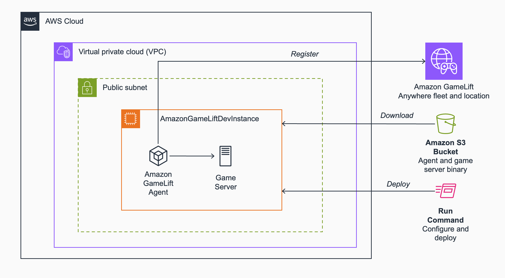
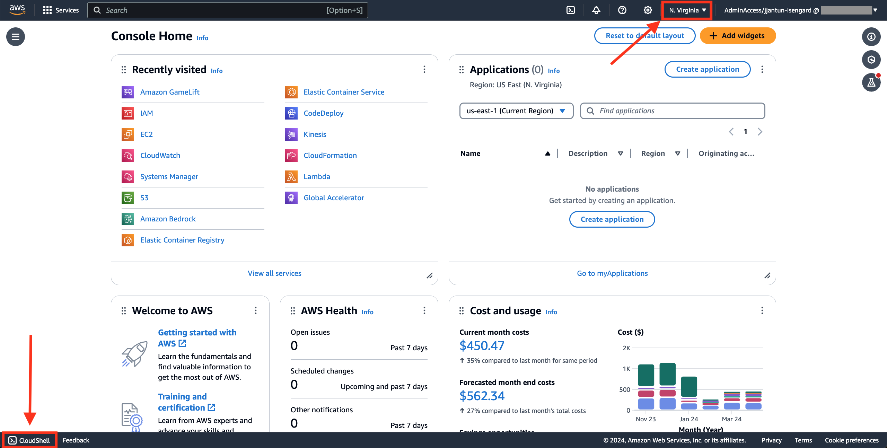
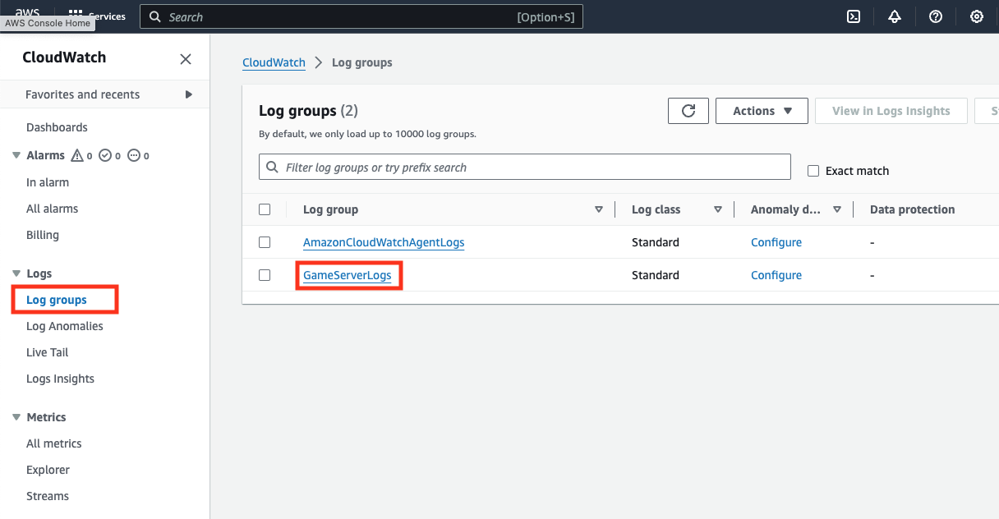
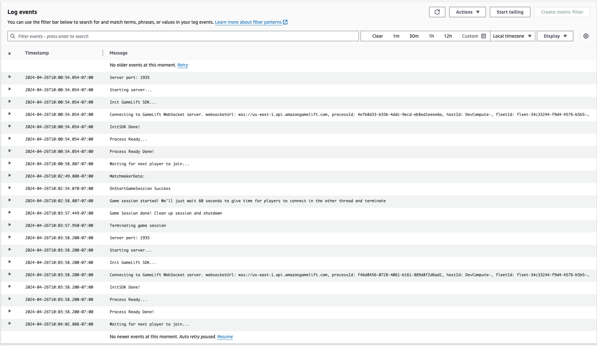
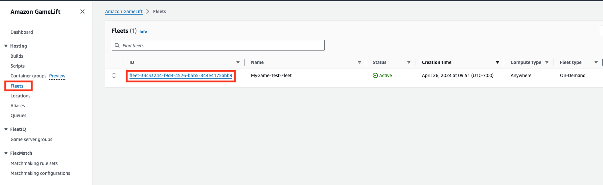

# Development instance with Amazon GameLift Anywhere and the Amazon GameLift Agent

When developing multiplayer games, you are constantly creating new game client and game server builds. Being able to test the latest changes quickly is important for getting feedback on feature updates and bug fixes. This fast iteration cycle allows you to keep developing without interruptions.

There are many aspects to automating the build and deployment cycle, and here we’re focusing on fast game server build updates utilizing Amazon GameLift Anywhere, and the [Amazon GameLift Agent](https://github.com/aws/amazon-gamelift-agent). Amazon GameLift is a fully-managed global game server hosting service. With the Amazon GameLift Anywhere feature, customers can host their game servers anywhere in the world in addition to the wide array of managed locations supported by Amazon GameLift Fleets. With Amazon GameLift Agent, it’s possible to utilize the same game session management capabilities that the managed service provides, but on your own EC2 instances or custom hardware. This provides a great way to host a development game server instance in the cloud that mimics the managed Amazon GameLift environment, but allows you to iterate on game server builds quickly without the need to always deploy a full production-ready fleet.

You will deploy our whole setup in the browser, utilizing the AWS Management Console and AWS CloudShell. To get started you need admin level access to an AWS account. This could be for example a development account dedicated to you or your team within your company’s AWS Organization. Optionally, if you’re working on a more restricted environment, having access to the individual services utilized including Amazon GameLift, AWS CloudShell, Amazon S3, AWS Systems Manager, Amazon EC2, and AWS IAM would allow you to run the scripts as well.

**NOTE:** Running these scripts will incur costs on your AWS account.

To learn more about developing and testing your games on Amazon GameLift, see [Set up for iterative development with Amazon GameLift Anywhere](https://docs.aws.amazon.com/gamelift/latest/developerguide/integration-dev-iteration.html)

# Contents

This sample consists of a deployment script and a configuration file:

* **`deploy_dev_instance.sh`**: This script deploys all the required resources to host the development instance
* **`dev-game-server-setup-and-deployment.json`**: The script defined in the AWS Systems Manager Run Command configuration file installs all the required tools on the EC2 instance when used with AWS SSM `run-command`. It also copies the Amazon GameLift Agent and the game server binary and starts the agent to host game server processes. The `deploy_dev_instance.sh` script will replace the Fleet ID and the S3 Bucket name in this file usind `sed` to refer to your specific resources.

# Architecture

The high level architecture of what you're deploying can be found below. It shows how the development EC2 instance is located in the Default VPC, as well as the other resources including an S3 bucket for GameLift Agent and game server binaries, Amazon GameLift Anywhere fleet and location, and using AWS Systems Manager Run Command to configure the instance and deploy new game server builds.



# Deployment

**Open** the AWS Management Console, and make sure your region is N.Virginia for this example. Then launch AWS CloudShell:



**Build** the sample C++ game server by **running** the script below in the AWS CloudShell. The server integrates with the Amazon GameLift Server SDK. This takes about 8-10 minutes, but for your own game server you would just build the SDK once and bring it to your game project. When using this solution with your own game you will replace this build with your own following [Customizing the configuration to your own needs](#customizing-the-configuration-to-your-own-needs). You can find the code for the server [here](https://github.com/aws-solutions-library-samples/guidance-for-custom-game-backend-hosting-on-aws/tree/main/BackendFeatures/AmazonGameLiftIntegration/SimpleServer) for reference.

```bash
git clone https://github.com/aws-solutions-library-samples/guidance-for-custom-game-backend-hosting-on-aws.git
cd guidance-for-custom-game-backend-hosting-on-aws/BackendFeatures/AmazonGameLiftIntegration/SimpleServer/
./buildserver.sh
cd ../LinuxServerBuild/ 
zip -r AmazonGameLiftSampleServerBinary.zip .
cp AmazonGameLiftSampleServerBinary.zip ../../../../
cd ../../../..

```

**Clone** this repository by running the following command in CloudShell:

```bash
git clone https://github.com/aws/amazon-gamelift-toolkit.git
```

To install the required tools, run the following command in CloudShell:

```bash
cd amazon-gamelift-toolkit/development-instance-with-amazon-gamelift-anywhere-and-gamelift-agent
sudo yum install java maven -y

```

**Open** the `deploy_dev_instance.sh` file in a text editor such as nano (`nano deploy_dev_instance.sh`) in AWS CloudShell, and **set** the name of the S3 Bucket (`BUCKET_NAME`) to a globally unique name of your choice (the namespace is global across AWS customers).

```bash
...
# TODO: Replace this with a globally unique name!
BUCKET_NAME="my-unique-bucket-name"
...
```

Then **run** the commands below in AWS CloudShell (this takes 2-3 minutes):

```bash
./deploy_dev_instance.sh
```

**NOTE:** The script expects that you have the *Default VPC* available in the AWS Region. It should always be there unless it has specifically been deleted by your account admin for example, in which case you would need to modify the script to use another VPC.

The script will perform the following steps:

1. It validates that you have the necessary tooling installed, and that the S3 bucket you used is available or already owned by you
2. It downloads the [Amazon GameLift Agent](https://github.com/aws/amazon-gamelift-agent), builds it, and then uploads to the S3 Bucket
3. It uploads the prebuilt [sample game server](https://github.com/aws-solutions-library-samples/guidance-for-custom-game-backend-hosting-on-aws/tree/main/BackendFeatures/AmazonGameLiftIntegration/SimpleServer) to the S3 Bucket
4. It creates an Amazon GameLift Anywhere location, as well as a GameLift Anywhere Fleet that is configured to run exactly one game server process with the binary name of the sample server
5. It creates and Amazon EC2 instance to host the agent, together with all other required resources
6. It runs and AWS Systems Manager Run Command to configure the EC2 instance with Amazon CloudWatch Agent for realtime logs, and deploys the agent and the build from S3 to the instance. It then starts the agent which will then start the game session.

The key resources this script deploys include:

* *Amazon S3 Bucket* for hosting your game server build and the Amazon GameLift Agent
* *Amazon EC2 Instance* that runs the Amazon GameLift Agent and the game server processes
* *Amazon EC2 Security Group* to allow inbound traffic
* *AWS IAM role* for the EC2 instance that allows it to access the required AWS services
* *Amazon GameLift Anywhere Fleet and Custom Location* that our game server processes register to for game session creation

The script also utilizes the prebuilt sample server from the [Amazon GameLift Integration guidance](https://github.com/aws-solutions-library-samples/guidance-for-custom-game-backend-hosting-on-aws/tree/main/BackendFeatures/AmazonGameLiftIntegration). You can replace this with your own game server that integrates with Amazon GameLift Server SDK.

If you run this script multiple times, it will avoid deploying the resources multiple times by checking if they exist first. It will however always do a new deployment through the SSM Run Command in the end. See [Customizing the configuration to your own needs](#customizing-the-configuration-to-your-own-needs) and [Deploying an updated version of the game server](#deploying-an-updated-version-of-the-game-server) for details on how to customize the solution for your own game server needs and how to deploy new versions without running the full script.

**NOTE:** You will need to **wait for about 30-60 seconds** for the game server to become active to host a game session.

# Test the deployment

Now that you have the game server running, it will take less than a minute for the new compute to register to the Anywhere fleet and the game session to be available.

Now **create** a game session on the Anywhere Fleet in your custom location to make sure everything works as expected. **Run** the following command in the CloudShell session you have open:

```bash
FLEET_ID=$(aws gamelift describe-fleet-attributes --query 'FleetAttributes[?Name==`MyGame-Test-Fleet`].FleetId' --output text)
aws gamelift create-game-session \
--fleet-id $FLEET_ID \
--region us-east-1 \
--maximum-player-session-count 5 \
--location custom-mygame-dev-location \
--game-properties "[{\"Key\":\"SomeKey\",\"Value\":\"SomeValue\"}]"
```

You should get a response JSON with information on the provisioned game session. If you receive an error there isn’t enough capacity, it means the game server hasn’t registered yet and you can try again in a few seconds. **NOTE:** If you for any reason have **two** fleets with the name *MyGame-Test-Fleet* on your account, setting the `FLEET_ID` above will fail. You will in this case need to manually set the variable or delete the extra fleets.

You are creating a session on your Anywhere Fleet in the custom location defined earlier. The Amazon GameLift Agent running on the EC2 instance provisions a logical compute resource in this custom location and starts the game server processes you’ve configured (just one in this sample). The game properties you pass to the game server in this command are available in the OnStartGameSession callback on the game server code, and can be used for things like loading the right map or game mode before activating the session.

The SSM command has configured the EC2 instance to install and run the CloudWatch Agent, and send the game server logs to CloudWatch Logs. **Open** the CloudWatch service in the AWS Management Console, **select** Log Groups and **select** GameServerLogs.




At this point you should only have one log stream and you can review the log output by opening that stream. The game server process will terminate itself after 60 seconds from the creation of the session, and a new one will be automatically provisioned by the GameLift Agent immediately. The server would also accept player connections over TCP on port 1935.

You can go to the Amazon GameLift console, and review the resources. **Open** the Amazon GameLift console, select Fleets and select the Amazon GameLift Anywhere Fleet you created earlier.



You can navigate through the tabs to see details on your Amazon GameLift Anywhere Fleet, including the game session you created on the fleet.

# Customizing the configuration to your own needs

When setting the development instance up with your own game server instead of the sample server you're using by default, you'll need to customize the `deploy_dev_instance.sh` script to upload the correct game server package to Amazon S3. You might want to separate parts of the script to separately set up the instance, and have a different script for uploading your latest game server build.

The Amazon CloudWatch Agent configuration set up in `dev-game-server-setup-and-deployment.json` that sends realtime logs to the service is downloaded as part of the game server package, and is configured specifically for the sample server. You would need to make sure you use a customized version of that configuration if you use your own game server binary.

Finally, in your own configuration you might have a different binary name, different command line arguments, and different number of processes. You would customize this by modifying the ` --runtime-configuration` within the `create-fleet` command in the `deploy_dev_instance.sh` script.

# Deploying an updated version of the game server

To update the game server binary, you would upload a new version to the S3 bucket generated by the script above, and run the AWS Systems Manager Run Command from the end of the script again. **NOTE:** Make sure you have the `INSTANCE_ID` variable set correctly if you've exited the CloudShell session in between:

```bash
aws ssm send-command --document-name "AWS-RunShellScript" \
--targets "Key=InstanceIds,Values=$INSTANCE_ID" \
--cli-input-json file://dev-game-server-setup-and-deployment.json \
--query 'Command.CommandId'
```

This will download the new game server build to the instance, terminate the agent and restart it to host the new build. You should be able to start game sessions on the new server in about one minute depending on your build size.

# Clean up

To clean up the resources, terminate the EC2 instance, and delete the Security Group in the EC2 Management Console. You can delete the IAM Role in the IAM console, and empty and delete the S3 bucket in the Amazon S3 console. For the GameLift resources, they aren’t generating any ongoing cost, but you can delete the Anywhere Fleet and the Custom Location from the Amazon GameLift console.
